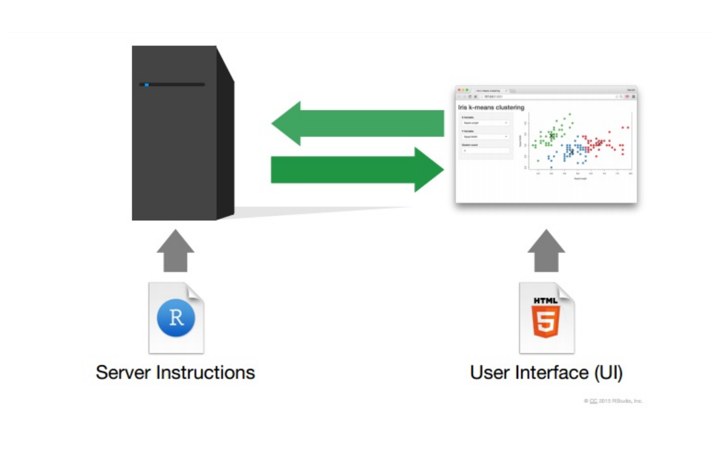
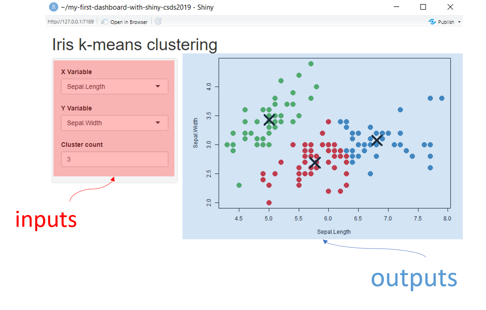
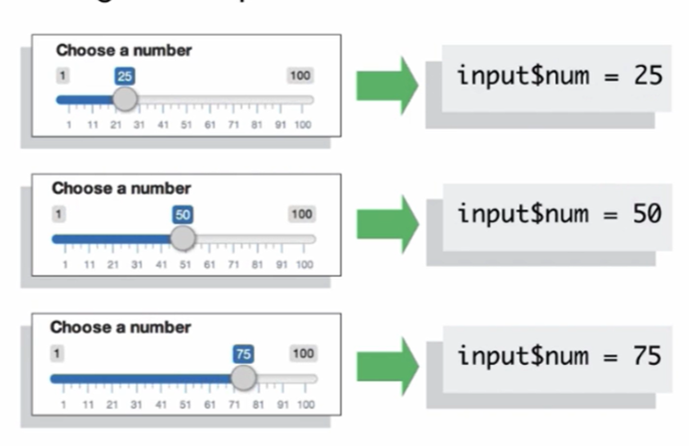
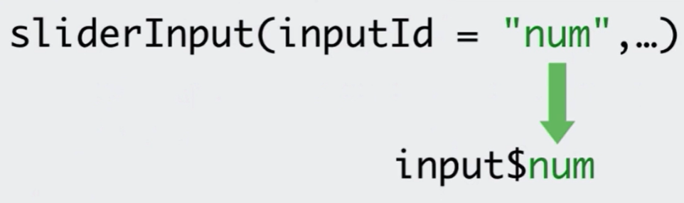

```{r setup, include=FALSE}
library(knitr)
library(shiny)
library(tidyverse)
options(htmltools.dir.version = FALSE)
```

class: middle

## Requirements

### - R v3.5.0 or superior

### - RStudio v1.2.0 or superior

### - Previous programming experience with R

### - Files [bit.ly/my-1st-shiny](bit.ly/my-1st-shiny)

---
class: middle, center


## [curso-r.com](http://curso-r.com)

## Athos Petri Damiani 


---
class: middle

## In this course, we are going to learn

### 1. How to build a Shiny App

### 2. Reactivity

### 3. Layouts (shinydashboard)

### 4. Deploy with Shinyapps.io (if we got time!)
 


---
class: middle

## Dynamic Dashboards



.footnote[
source: [rstudio.com/shiny/](http://www.rstudio.com/shiny/)
]

---
class: middle, center


### Motivation:

### [Shiny Gallery](https://shiny.rstudio.com/gallery/)
 
### [Show me Shiny Website](https://www.showmeshiny.com/)

---

## Hello World

```{r, echo=TRUE, eval=FALSE}
library(shiny)

ui <- fluidPage("Hello World!")

server <- function(input, output, session) {
  
}

shinyApp(ui, server)
```

---
class: middle, center

## To R!


---

## Inputs and Outputs




```{r, echo = TRUE, eval = FALSE}
ui <- fluidPage(
  # *Input() functions,
  # *Output() functions
)
```

---

## Inputs 


.footnote[
source: [rstudio.com/shiny/](http://www.rstudio.com/shiny/)
]


---

## Outputs

```{r, echo = FALSE, eval=TRUE}
tibble::tribble(~Function, ~Output,
        "imageOutput()", "image",
        "plotOutput()", "plot",
        "tableOutput()", "table",
        "textOutput()", "text",
        "verbatimOutput()", "text",
        "htmlOutput()", "raw HTML",
        "dataTableOutput()", "interactive table",
        "uiOutput()", "a Shiny UI element") %>% knitr::kable(format = "html")
```


---

## In the "hello world" example, lets...

1) insert a slider input accepting values from 1 to 100.

2) insert a plot output.

3) insert a text input. (exercise!)

---

## Server


```{r, echo = TRUE, eval = FALSE}

server <- function(input, output, session) {
  
  
  
  
  

}
```

---

## Server

```{r, echo = TRUE, eval = FALSE}

server <- function(input, output, session) {
  
  output$hist <- renderPlot({
    hist(rnorm(100))    
  })

}
```

--

remember our UI setup...

```{r, echo = TRUE, eval = FALSE}
ui <- fluidPage(
  
  ...
  
  plotOutput("hist")
)

```


---

## Server

### render*() functions

.pull-left[

```{r, echo = FALSE, eval=TRUE}
tibble::tribble(~`*output()`, ~`render*()`,
        "imageOutput()", "renderImage()",
        "plotOutput()", "renderPlot()",
        "tableOutput()", "renderTable()",
        "textOutput()", "renderText()",
        "verbatimOutput()", "renderText()",
        "htmlOutput()", "renderUI()",
        "dataTableOutput()", "renderDataTable()",
        "uiOutput()", "renderUI()") %>% knitr::kable(format = "html")
```


]

.pull-right[

```{r, echo = TRUE, eval = FALSE}
# ui
plotOutput("hist")
```

```{r, echo = TRUE, eval = FALSE}
# server
output$hist <- renderPlot({
  hist(rnorm(100))    
})
```


]


---

## Reactive Values and Reactive Functions

Use input values with **`input$`**

.pull-left[



]

.pull-right[



- `render*()` are **reactive functions**

- `input$*` are **reactive values**


]

.footnote[
source: [rstudio.com/shiny/](http://www.rstudio.com/shiny/)
]

--

If we put **`input$num`** inside the **`renderPlot()`** in our example, the output would **`react`** if slider were changed by user.

```{r, echo = TRUE, eval = FALSE}
# server
hist(rnorm(input$num))
```


---

## Server

### Recap:

Inside `server` function,

1) save the output using **`output$hist <-`**

2) feed the output **`render*()`** function with code

3) access **input values** with **`input$*`**

4) create reactivity by using  **`input$*`** inside **`render*()`** functions

```{r, echo = TRUE, eval = FALSE}
# server
output$hist <- renderPrint({
  hist(rnorm(input$num))    
})
```

---

## Back to our "hello world" example...

1) lets use `renderPlot({})` inside sever to display a plot into `"hist"` slot.


2) after that, lets make `rnorm()` depending on `input$num` instead of `100`.


3) then, lets make the title of the histogram depending on the text input that you created before. (exercise!)

4) finally, create an **`verbatimTextOuput("summary")`** and feed it with **`summary(rnorm(input$num))`** using **`renderText()`**. (exercise!)

---

class: middle, center, inverse

# Reactivity

---

## Reactivity

Reactivity is the relationship between **reactive values** and **reactive functions**: **reactive values** triggers **reactive functions**


---

## Reactive Context

Reactive values must be usend in Reactive Context.

### Right

```{r, echo=TRUE, eval= FALSE}
# server
* output$hist <- renderPlot({hist(rnorm(input$num))})
```

### Wrong

```{r, echo = TRUE, eval=FALSE}
# server
output$hist <- hist(rnorm(input$num))
```


---

## Reactive Functions

### Main reactive functions in Shiny

- **`render*({})`**

- **`reactive({})`**

- **`isolate({})`**

- **`observe({})`**

- **`eventReactive({})`**

- **`oberveEvent({})`**

---

## Reactive Functions

### **`reactive({})`**

Builds a **reactive expression** (behaves like the **`input$*`**!).

```{r, echo = TRUE, eval=FALSE}
# server
data <- reactive({
  rnorm(input$num)
})
```

Is used like an ordinary function:

```{r, echo = TRUE, eval=FALSE}
# server
output$summary <- renderPrint({
  summary(data())
})
```

---

## Reactive Functions

### **`reactive({})`**


1) Exercise: create the data() reactive expression in the 'hello world' example.

.footnote[
source: [rstudio.com/shiny/](http://www.rstudio.com/shiny/)
]


---

## Reactive Functions

### **`isolate({})`**

Turn an **reactive value** into a **non-reactive value**.

```{r, echo = TRUE, eval=FALSE}
# server
output$hist <- renderPlot({
* title <- isolate(input$title)
  hist(data(), main = title)
})
```

Now **`renderPlot({})`** will NOT react if **`input$title`** changes.


---

## Reactive Functions

### **`observeEvent({})`**

Useful to trigger a block of code to run on server whenever a given **`input$*`** changes.

```{r, echo = TRUE, eval=FALSE}
# ui
actionButton("write_data", "Write Data as CSV")
```

```{r, echo = TRUE, eval=FALSE}
# server
observeEvent(input$write_data, {
  write.csv(data(), "data.csv")
})
```

PS: action button is just another type of input! Useful along **`observeEvent()`**. See [Using Action Button](https://shiny.rstudio.com/articles/action-buttons.html) from Shiny docs.

To R...

---

## Reactive Functions

### **`observe({})`**

Also useful to trigger a block of code to run on server, but any **reactive value** inside the code will trigger it.

```{r, echo = TRUE, eval=FALSE}
# server
observe({
  print(data())
  print(as.numeric(input$writ_data))
})
```


---

## Reactive Functions

### **`eventReactive({})`**


Create a **reactive value** whenever a specified **`input$*`** changes (or any other **reactive value**).

```{r, echo = TRUE, eval=FALSE}
# ui
actionButton("update", "Update!")
```

```{r, echo = TRUE, eval=FALSE}
# server
data <- eventReactive(input$update, {
  write.csv(data(), "data.csv")
})
```


To R...

---

class: middle, center, inverse

# Layouts

---

## But first... HTML Tags

```{r, echo = TRUE, eval = FALSE}
fluidPage(
  tags$h1("My First Shiny App"),
  tags$p(
    "The link to the Shiny website is",
    tags$a(href = "https://www.rstudio.com/shiny/", "rstudio.com/shiny."),
    tags$strong("I strongly recommend that you take a look at it!")
  )
)
```

```{html}
<div class="container-fluid">
  <h1>My First Shiny App</h1>
  <p>
    The link to the Shiny website is
    <a href="https://www.rstudio.com/shiny/">rstudio.com/shiny.</a>
    <strong>I strongly recommend that you take a look at it!</strong>
  </p>
</div>
```

---

## But first... HTML Tags

```{r, echo = TRUE, eval = FALSE}
names(tags)
```
```{r, echo = FALSE}
head(names(tags), 45)
```
...

```{r, echo = TRUE, eval = FALSE}
tags$h1("My First Shiny App")

## <h1>My First Shiny App</h1>
```

---

## But first... HTML Tags

The most commonly used tags are:

```{r, echo = FALSE, eval=TRUE}
tibble::tribble(~`R function`, ~`HTML`,
        "a()", "a hyperlink",
        "hr()", "horizontal line",
        "br()", "line break",
        "code()", "monospaced code styled text",
        "h1(), ..., h6()", "headers",
        "img()", "image",
        "p()", "paragraph",
        "em()", "italic text",
        "strong()", "bold text") %>% knitr::kable(format = "html")
```

---

## Grid System

Two main layout functions

```{r, echo=TRUE, eval = FALSE}
fluidRow()
```
```{r, echo=FALSE, eval = TRUE}
cat(as.character(fluidRow()))
```

```{r, echo=TRUE, eval = FALSE}
column(2)
```
```{r, echo=FALSE, eval = TRUE}
cat(as.character(column(2)))
```

---

## Grid System


- Each row is a **`fluidRow()`**.
- **`columns`** are divided up to 12 parts. The **`width`** determines how many parts wide are the column.

.footnote[
source: [dzone.com/articles/working-with-bootstrap-4-grid-system-for-creating](https://dzone.com/articles/working-with-bootstrap-4-grid-system-for-creating)
]

---

class: middle, center, inverse

# Shinyapps.io


---

## Reference

This course is based on [Garrett Grolemund's Shiny Tutorial](https://shiny.rstudio.com/tutorial/).

---

class: middle, center, inverse

# Thank you!


## athos.damiani@curso-r.com