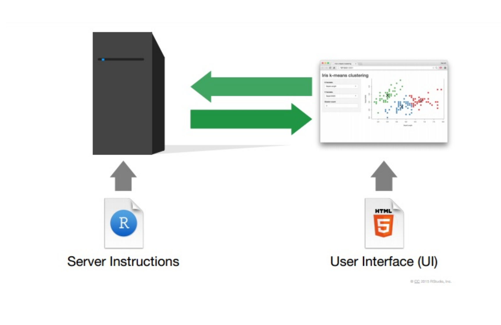

```{r setup, include=FALSE}
options(htmltools.dir.version = FALSE)
```

class: middle, center


## [curso-r.com](http://curso-r.com)

## Athos Petri Damiani 


---
class: middle

## In this course, we are going to learn

### 1. How to build a Shiny App

### 2. Reactives

### 3. Shinydashboard UI

### 4. Deploy with Shinyapps.io


---
class: middle

## Requirements

### - R v3.5.0 or superior

### - RStudio v1.2.0 or superior

### - Previous programming experience with R

---
class: middle

## Dynamic Dashboards



---
class: middle, center


---

## Hello World

```{r, echo=TRUE, eval=FALSE}
library(shiny)

ui <- fluidPage("Hello World!")

server <- function(input, output, session) {
  
}

shinyApp(ui, server)
```

---
class: middle, center

## To R!


---
class: middle

## Inputs and Outputs


---
class: middle

## To R!